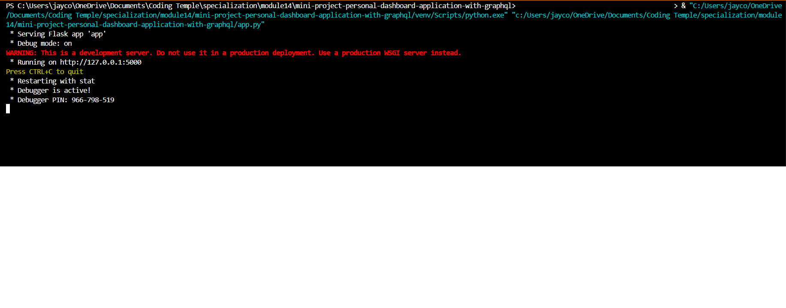
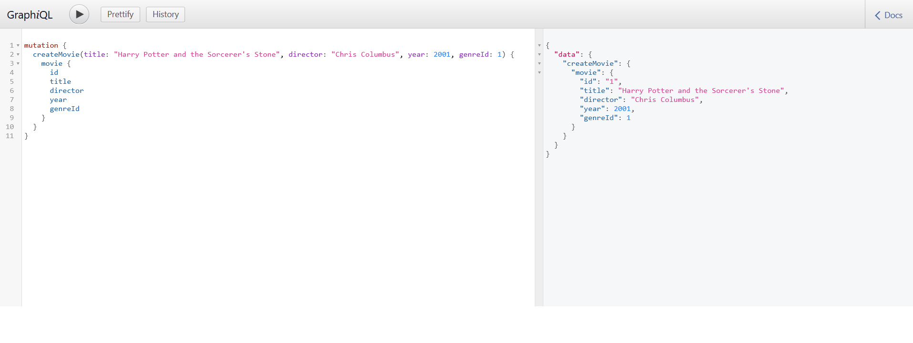
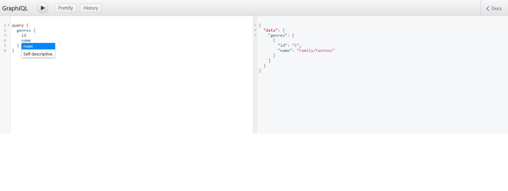
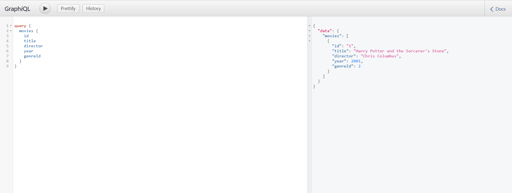
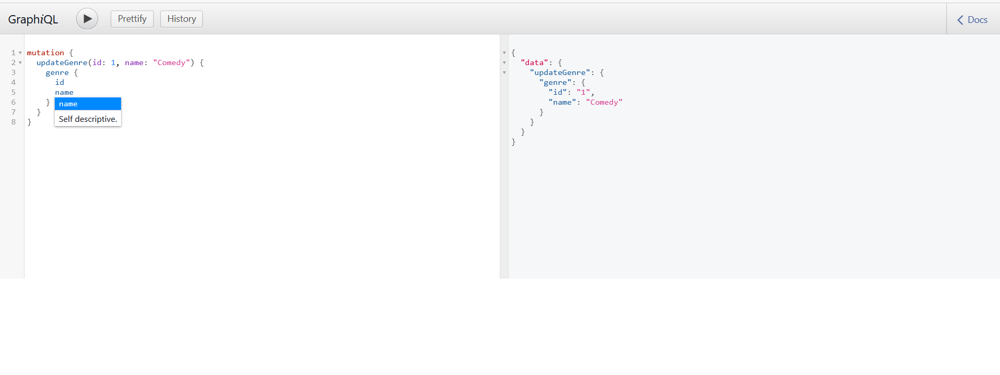
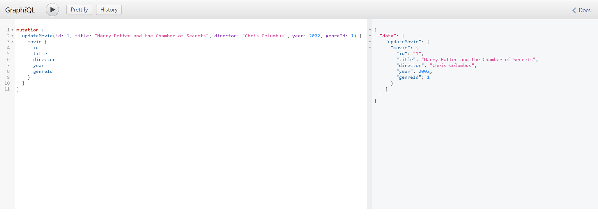
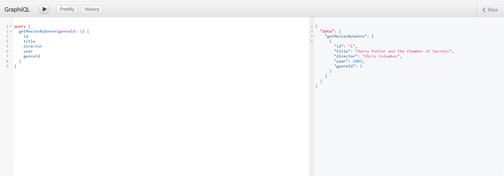
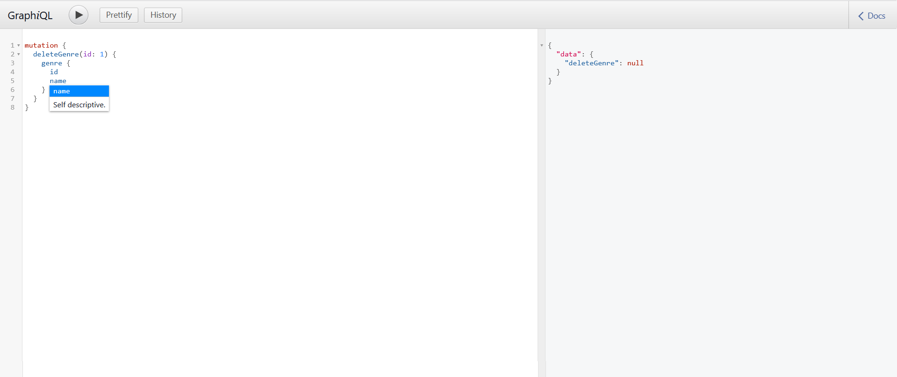
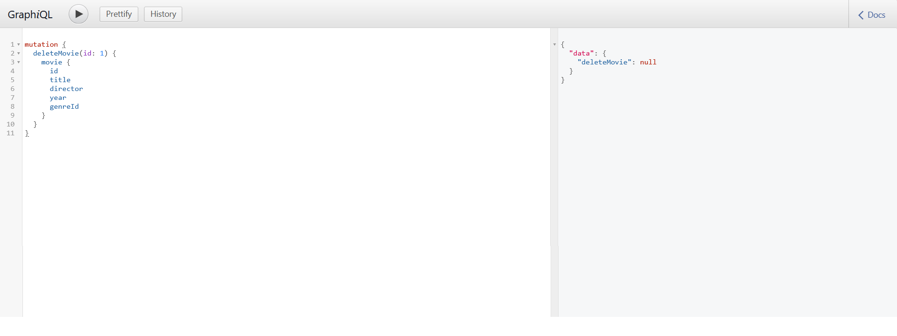
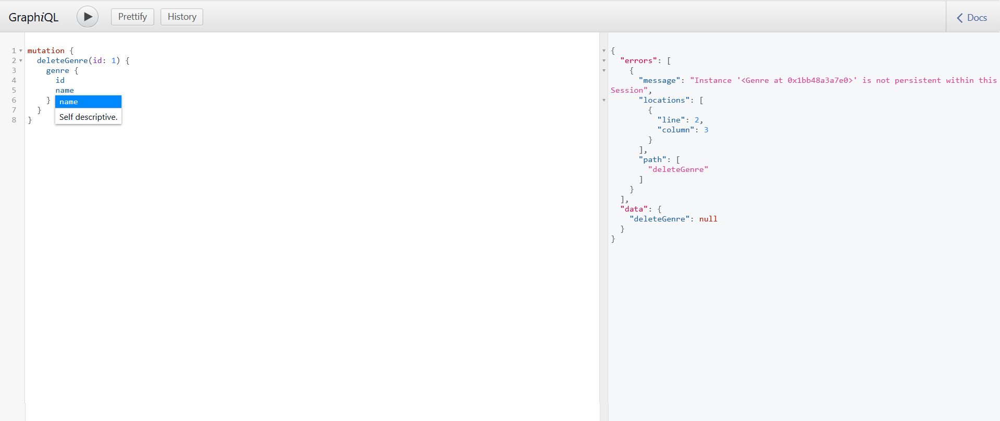

# Mini-Project: Movie Management API

- Author: Jaycob Hoffman

- Date: 17 February 2025

## Description

This project is a comprehensive API for managing movies within a MySQL database. It uses Flask, SQLAlchemy, and GraphQL to create an intuitive and flexible user experience while allowing users full control over the movies within the database.

## How to Run

When users first run the server, the following message will appear within their CLI:

Paste the link (http://127.0.0.1:5000) into your browser followed by "/graphql" to access the GraphQL interface.

## Features

- **Create Genre** (Note: users must create a genre before creating a movie)

- **Create Movie**

- **Query Genre**

- **Query Movie**

- **Update Genre**

- **Update Movie**

- **Get Genre by Movie**

- **Get Movies by Genre**

- **Delete Genre**

- **Delete Movie**

## Errors

Occasionally, when writing the mutation to delete a movie or genre, the following error will occur (example):

Solve this error by restarting the server and running the command again.

#

View the Movie Management API [GitHub Repository](https://github.com/JaycobHoffman1/module14-mini-project)